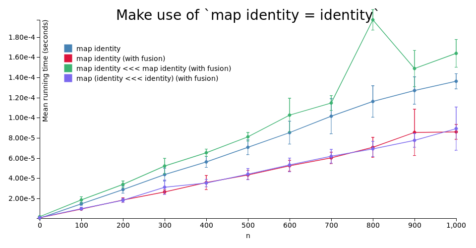
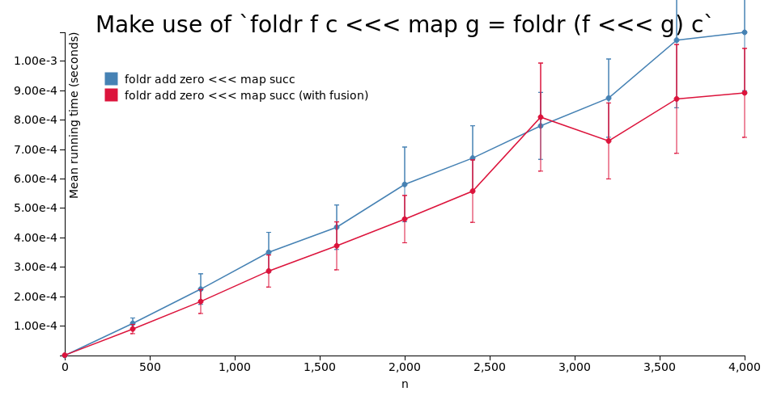
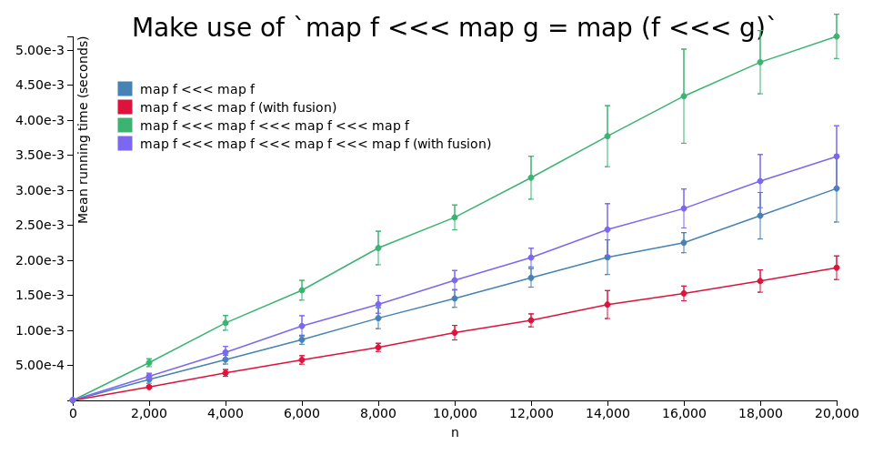

# purescript-fusion

A proof-of-concept showing how fusion, a.k.a. deforestation, can be implemented ad-hoc for some set of fusion laws in purescript. Laws are defined as instances of the `Fusion` class - see the code for more info.

This approach is not extensible: the user is not able to define their own laws.

There are other issues (note the green line on the first image, which appears higher than it should).

# Benchmarks

